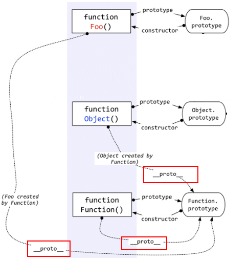

# JS函数高级

## 1、原型与原型链

### 1、原型(prototype)

#### 1、函数的prototype属性

- 每个函数都有一个prototype属性，它默认指向一个空的Object对象(即原型对象)

- 原型对象中有一个属性constructor，它指向函数对象

```javascript
  function Fun () {//alt + shift +r(重命名rename)

  }
  console.log(Fun.prototype.constructor===Fun)
```

#### 2、给原型对象添加属性(一般都是方法)

- 作用:函数的所有实例对象自动拥有原型中的属性(方法)

```javascript
  function Fun () {//alt + shift +r(重命名rename)

  }
  Fun.prototype.test = function () {
    console.log('test()')
  }
  var fun = new Fun()
  fun.test()
```

### 2、显示原型与隐式原型

- 每个函数function都有一个prototype，即显示原型(属性)

- 每个实例对象都有一个\_\_prop\_\_属性，即隐式原型(属性)

- 对象的隐式原型的值为其对应构造函数的显示原型的值

- 内存结构图

  

- 总结

  - 函数的prptotype属性:在定义函数时自动添加，默认为一个空的object对象
  - 对象的__prop\_\_属性：创建对象时自动添加，默认值为构造函数的prototype属性值
  - 在es6之前，只能操作显示原型，不能操作隐式原型

- 事例代码

```javascript
  //定义构造函数
  function Fn() {   // 内部语句: this.prototype = {}

  }
  // 1. 每个函数function都有一个prototype，即显式原型属性, 默认指向一个空的Object对象
  console.log(Fn.prototype)
  // 2. 每个实例对象都有一个__proto__，可称为隐式原型
  //创建实例对象
  var fn = new Fn()  // 内部语句: this.__proto__ = Fn.prototype
  console.log(fn.__proto__)
  // 3. 对象的隐式原型的值为其对应构造函数的显式原型的值
  console.log(Fn.prototype===fn.__proto__) // true
```


### 3、原型链

- 原型链

  - 访问一个对象的属性时
    - 先在自身属性中查找，找到则返回
    - 如果没有，再沿着__prop\_\_这条链向上查找找到返回
    - 如果依然没有找到，返回undefined
  - 别名：隐式原型链
  - 作用：查找对象的属性(方法)

- 构造函数/原型/实体对象的关系(图解)

  ```javascript
  var o1 = new Object();
  var o2 = {};
  ```

  

- 构造函数/原型/实体对象的关系2(图解)

  ```javascript
  function Foo(){  }
  ```

  

- 代码

```javascript
  // console.log(Object)
  //console.log(Object.prototype)
  console.log(Object.prototype.__proto__)
  function Fn() {
    this.test1 = function () {
      console.log('test1()')
    }
  }
  console.log(Fn.prototype)
  Fn.prototype.test2 = function () {
    console.log('test2()')
  }

  var fn = new Fn()

  fn.test1()
  fn.test2()
  console.log(fn.toString())
  console.log(fn.test3)
  // fn.test3()


  /*
  1. 函数的显示原型指向的对象默认是空Object实例对象(但Object不满足)
   */
  console.log(Fn.prototype instanceof Object) // true
  console.log(Object.prototype instanceof Object) // false
  console.log(Function.prototype instanceof Object) // true
  /*
  2. 所有函数都是Function的实例(包含Function)
  */
  console.log(Function.__proto__===Function.prototype)
  /*
  3. Object的原型对象是原型链尽头
   */
  console.log(Object.prototype.__proto__) // null
```

原型链图解


- 原型链属性问题

  - 读取对象属性时：会自动到原型链中查找
  - 设置对象的属性值时：不会自动查找原型链，如果当前对象中没有此属性，直接添加此属性并设置其值
  - 方法一般定义在原型中, 属性一般通过构造函数定义在对象本身上

  代码

  ```javascript
    function Fn() {
  
    }
    Fn.prototype.a = 'xxx'
    var fn1 = new Fn()
    console.log(fn1.a, fn1)
  
    var fn2 = new Fn()
    fn2.a = 'yyy'
    console.log(fn1.a, fn2.a, fn2)
  
    function Person(name, age) {
      this.name = name
      this.age = age
    }
    Person.prototype.setName = function (name) {
      this.name = name
    }
    var p1 = new Person('Tom', 12)
    p1.setName('Bob')
    console.log(p1)
  
    var p2 = new Person('Jack', 12)
    p2.setName('Cat')
    console.log(p2)
    console.log(p1.__proto__===p2.__proto__) // true
  ```

### 4、instanceof原理

#### 1、instanceof是如何判断的

- 表达式：A instanceof B
- 如果B函数的显式原型对象在A对象的原型链上, 返回true, 否则返回fals

#### 2、Function是通过new自己产生的实例

代码

```javascript
 function Foo() {  }
  var f1 = new Foo()
  console.log(f1 instanceof Foo) // true
  console.log(f1 instanceof Object) // true

  /*
  案例2
   */
  console.log(Object instanceof Function) // true
  console.log(Object instanceof Object) // true
  console.log(Function instanceof Function) // true
  console.log(Function instanceof Object) // true

  function Foo() {}
  console.log(Object instanceof  Foo) // false
```

##### 5、面试题

- 面试题一

  ```java
    function A () {
  
    }
    A.prototype.n = 1
  
    var b = new A()
  
    A.prototype = {
      n: 2,
      m: 3
    }
  
    var c = new A()
    console.log(b.n, b.m, c.n, c.m) // 1 undefined 2 3
  ```

- 面试题2

  ```javascript
    function F (){}
    Object.prototype.a = function(){
      console.log('a()')
    }
    Function.prototype.b = function(){
      console.log('b()')
    }
    
    var f = new F()
    f.a()
    // f.b()
    F.a()
    F.b()
    console.log(f)
    console.log(Object.prototype)
    console.log(Function.prototype)
  ```

  


## 2、执行上下文与执行上下文栈

### 1、变量提升与函数提升

#### 1、变量声明提升

- 通过var定义(声明)的变量，在定义语句之前就可以访问到
- 值:undefined

#### 2、函数声明提前

- 通过function声明的函数，在之前就可以直接调用
- 值：函数定义(对象)

```javascript
  var a = 3
  function fn () {
    console.log(a)
    var a = 4
  }
  fn()
  console.log(b) //undefined  变量提升
  fn2() //可调用  函数提升
  // fn3() //不能  变量提升

  var b = 3
  function fn2() {
    console.log('fn2()')
  }

  var fn3 = function () {
    console.log('fn3()')
  }
```


### 2、执行上下文

#### 1、代码分类

- 全局代码
- 函数(局部)代码

#### 2、全局执行上下文

- 在执行全局代码之前将window确定为全局执行上下文
- 对全局数据进行预处理
  - var定义的全局变量==>undefined，添加为window的方法
  - this==>赋值（window）
- 开始执行全局代码

#### 3、函数执行上下文

- 在调用函数，准备执行函数体之前，创建对应的函数执行上下文对象(虚拟的存在于栈中)
- 对局部变量进行预处理
  - 形参变量==>赋值(实参)==>添加为执行上下文的属性
  - arguments==>赋值(实参列表), 添加为执行上下文的属性
  - var定义的局部变量==>undefined, 添加为执行上下文的属性
  - function声明的函数 ==>赋值(fun), 添加为执行上下文的方法
  - this==>赋值(调用函数的对象)
- 开始执行函数代码

### 3、执行上下文栈

1. 在全局代码执行前, JS引擎就会创建一个栈来存储管理所有的执行上下文对象
2. 在全局执行上下文(window)确定后, 将其添加到栈中(压栈)
3. 在函数执行上下文创建后, 将其添加到栈中(压栈)
4. 在当前函数执行完后,将栈顶的对象移除(出栈)
5. 当所有的代码执行完后, 栈中只剩下window


面试题1

```html
<!DOCTYPE html>
<html lang="en">
<head>
  <meta charset="UTF-8">
  <title>04_执行上下文栈2</title>
</head>
<body>
<!--
1. 依次输出什么?
  gb: undefined
  fb: 1
  fb: 2
  fb: 3
  fe: 3
  fe: 2
  fe: 1
  ge: 1
2. 整个过程中产生了几个执行上下文?  5
-->
<script type="text/javascript">
  console.log('gb: '+ i)
  var i = 1
  foo(1)
  function foo(i) {
    if (i == 4) {
      return
    }
    console.log('fb:' + i)
    foo(i + 1) //递归调用: 在函数内部调用自己
    console.log('fe:' + i)
  }
  console.log('ge: ' + i)
</script>
</body>
</html>
```

面试题2

```html
<!DOCTYPE html>
<html lang="en">
<head>
  <meta charset="UTF-8">
  <title>05_面试题</title>
  <link rel="stylesheet" href="xxx.css">
  <style>

  </style>
</head>
<body>
<div style=""></div>
<script type="text/javascript">

  /*
   测试题1:  先执行变量提升, 再执行函数提升
   */
  function a() {}
  var a
  console.log(typeof a) // 'function'


  /*
   测试题2:
   */
  if (!(b in window)) {
    var b = 1
  }
  console.log(b) // undefined

  /*
   测试题3:
   */
  var c = 1
  function c(c) {
    console.log(c)
    var c = 3
  }
  c(2) // 报错

</script>
</body>
</html>
```

## 3、作用域与做用域链

### 1、作用域

#### 1、什么是作用域

- 就是一块“地盘”，一段代码所在的区域
- 他是静态的（相对于上下文对象），在编写代码时就确定了

#### 2、分类

- 全局作用域
- 函数作用域
- 块级作用域(ES6)

#### 3、作用

- 隔离变量，不同作用域下的不同变量不会有命名冲突

例子

```javascript
  if(true) {
    var c = 3
  }
  console.log(c)*/

  var a = 10,
    b = 20
  function fn(x) {
    var a = 100,
      c = 300;
    console.log('fn()', a, b, c, x)
    function bar(x) {
      var a = 1000,
        d = 400
      console.log('bar()', a, b, c, d, x)
    }

    bar(100)
    bar(200)
  }
  fn(10)
```

图解


### 2、作用域与执行上下文

#### 1、区别1

- 全局作用域之外，每个函数都会创建自己的作用域，作用域在函数定义时就已经定义好了。而不是在函数调用时
- 全局执行上下文环境是在全局作用域确定之后，js代码执行之前创建
- 函数执行上下文是在函数调用时，函数体代码执行之前创建。

#### 2、区别2

- 作用域是静态的，只要函数定义好了就一定存在，且不会变化
- 执行上下文是动态的，调用函数时创建，函数调用结束时自动释放

#### 3、联系

- 执行上下文(对象)从属与所在作用域
- 全局上下文环境==>全局作用域
- 函数上下文环境==>对应的函数作用域

例子

```javascript
  var a = 10,
    b = 20
  function fn(x) {
    var a = 100,
      c = 300;
    console.log('fn()', a, b, c, x)
    function bar(x) {
      var a = 1000,
        d = 400
      console.log('bar()', a, b, c, d, x)
    }

    bar(100)
    bar(200)
  }
  fn(10)
```

图解


### 3、作用域链

#### 1、什么是作用域链

- 多个上下级关系的作用域形成的链，他的方向是从上而下（从内而外的）
- 查找变量就是沿着作用域链查找的

#### 2、查找一个变量的查找规则

- 在当前作用域下的执行上下文中查找对应的属性, 如果有直接返回, 否则进入2
- 在上一级作用域的执行上下文中查找对应的属性, 如果有直接返回, 否则进入3
- 再次执行2的相同操作, 直到全局作用域, 如果还找不到就抛出找不到的异常

实例

```javascript
  var a = 1
  function fn1() {
    var b = 2
    function fn2() {
      var c = 3
      console.log(c)
      console.log(b)
      console.log(a)
      console.log(d)
    }
    fn2()
  }
  fn1()
```


#### 3、面试题1

```javascript
<!DOCTYPE html>
<html lang="en">
<head>
  <meta charset="UTF-8">
  <title>04_作用域_面试题</title>
</head>
<body>
<script type="text/javascript">
  var x = 10;
  function fn() {
    console.log(x);
  }
  function show(f) {
    var x = 20;
    f();
  }
  show(fn); // 10


</script>
</body>
</html>
```

#### 4、面试题2

```javascript
<!DOCTYPE html>
<html lang="en">
<head>
  <meta charset="UTF-8">
  <title>04_作用域_面试题2</title>
</head>
<body>
<script type="text/javascript">
  var fn = function () {
    console.log(fn)
  }
  fn()

  var obj = {
    fn2: function () {
     console.log(fn2)
     //console.log(this.fn2)
    }
  }
  obj.fn2()
</script>
</body>
</html>
```


