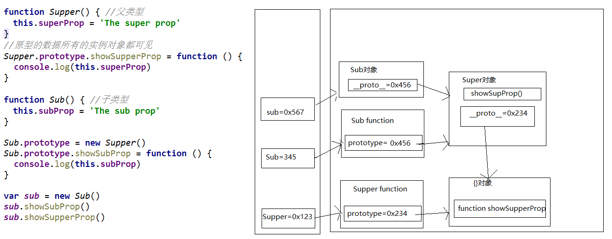

# JS对象进阶

## 1、对象创建模式

### 1、Object构造函数模式

- 套路：先创建空的Object对象，再动态添加属性/方法.
- 适用场景：起始时不确定内部数据
- 缺点：语句太多

实例代码：

```javascript
  var p = new Object()
  p = {} //此时内部数据是不确定的
  // 再动态添加属性/方法
  p.name = 'Tom'
  p.age = 12
  p.setName = function (name) {
    this.name = name
  }
```

### 2、对象字面量

- 套路：使用{}创建对象，同时指定属性/方法
- 使用场景：起始时对象内部数据是确定的
- 缺点：如果创建多个对象，有重复代码

实例代码

```javascript
  var p = {
    name: 'Tom',
    age: 12,
    setName: function (name) {
      this.name = name
    }
  }
```

### 3、工厂模式

- 套路：通过工厂函数动态创建对象并返回
- 使用场景：需要创建多个对象
- 缺点：对象没有一个具体的类型，都是Object类型

代码实例

```javascript
  function createPerson(name, age) { //返回一个对象的函数===>工厂函数
    var obj = {
      name: name,
      age: age,
      setName: function (name) {
        this.name = name
      }
    }

    return obj
  }

  // 创建2个人
  var p1 = createPerson('Tom', 12)
  var p2 = createPerson('Bob', 13)

  // p1/p2是Object类型

  function createStudent(name, price) {
    var obj = {
      name: name,
      price: price
    }
    return obj
  }
  var s = createStudent('张三', 12000)
  // s也是Object
```

### 4、自定义构造函数模式

- 套路：自定义构造函数，通过new创建对象
- 使用场景：需要创建多个类型确定的对象
- 缺点：每个对象都有相同的数据，浪费内存

```javascript
  //定义类型
  function Person(name, age) {
    this.name = name
    this.age = age
    this.setName = function (name) {
      this.name = name
    }
  }
  var p1 = new Person('Tom', 12)
  p1.setName('Jack')
  console.log(p1.name, p1.age)
  console.log(p1 instanceof Person)

  function Student (name, price) {
    this.name = name
    this.price = price
  }
  var s = new Student('Bob', 13000)
  console.log(s instanceof Student)

  var p2 = new Person('JACK', 23)
  console.log(p1, p2)
```

### 5、最终版本(构造函数+原型的组合模式)

- 套路：自定义构造函数，属性在函数中初始化，方法添加到原型上
- 适用场景：需要创建多个类型确定的对象

实例代码

```javascript
  function Person(name, age) { //在构造函数中只初始化一般函数
    this.name = name
    this.age = age
  }
  Person.prototype.setName = function (name) {
    this.name = name
  }

  var p1 = new Person('Tom', 23)
  var p2 = new Person('Jack', 24)
  console.log(p1, p2)
```

## 2、继承模式

### 1.原型链继承

- 步骤
  - 定义父类型的构造函数
  - 给父类型的原型添加方法
  - 定义子类型的构造函数
  - 创建父类型的对象赋值给子类型的原型
  - 将子类型原型的构造属性设置为子类型
  - 给子类型原型添加方法
  - 创建子类型的对象：可以调用父类型的方法
- 关键
  - 子类型的原型为父类型的一个实例对象

实例代码

```javascript
 //父类型
  function Supper() {
    this.supProp = 'Supper property'
  }
  Supper.prototype.showSupperProp = function () {
    console.log(this.supProp)
  }

  //子类型
  function Sub() {
    this.subProp = 'Sub property'
  }

  // 子类型的原型为父类型的一个实例对象
  Sub.prototype = new Supper()
  // 让子类型的原型的constructor指向子类型
  Sub.prototype.constructor = Sub
  Sub.prototype.showSubProp = function () {
    console.log(this.subProp)
  }

  var sub = new Sub()
  sub.showSupperProp()
  // sub.toString()
  sub.showSubProp()

  console.log(sub)  // Sub
```

代码图解



### 2、借用构造函数继承(假继承)

- 套路
  - 定义父类型构造函数
  - 定义子类型构造函数
  - 在子类型构造函数中调用父类型构造函数
- 关键
  - 在子类的构造函数中通过call()调用父类型构造函数

实例代码

```javascript
  function Person(name, age) {
    this.name = name
    this.age = age
  }
  function Student(name, age, price) {
    Person.call(this, name, age)  // 相当于: this.Person(name, age)
    /*this.name = name
    this.age = age*/
    this.price = price
  }

  var s = new Student('Tom', 20, 14000)
  console.log(s.name, s.age, s.price)
```

### 3、组合继承(原型链+借用构造函数的组合继承)

- 利用原型链实现对父类型对象的方法继承
- 利用super()借用父类型的构造函数初始化相同属性

实例代码

```javascript
  function Person(name, age) {
    this.name = name
    this.age = age
  }
  Person.prototype.setName = function (name) {
    this.name = name
  }

  function Student(name, age, price) {
    Person.call(this, name, age)  // 为了得到属性
    this.price = price
  }
  Student.prototype = new Person() // 为了能看到父类型的方法
  Student.prototype.constructor = Student //修正constructor属性
  Student.prototype.setPrice = function (price) {
    this.price = price
  }

  var s = new Student('Tom', 24, 15000)
  s.setName('Bob')
  s.setPrice(16000)
  console.log(s.name, s.age, s.price)
```

